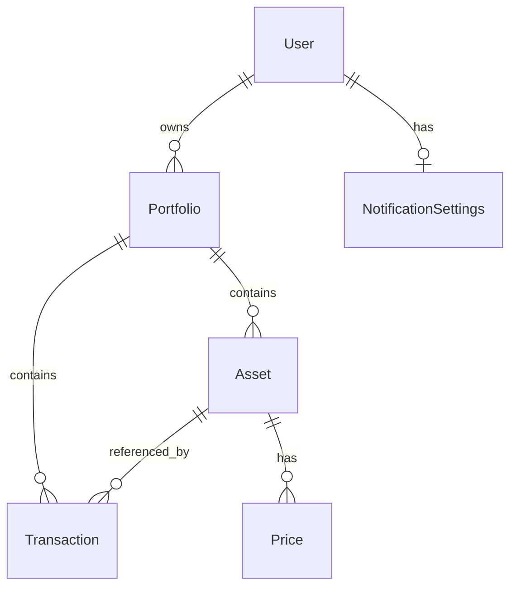

# Domain Rules

> 마지막 업데이트: 2026-01-19

## 1. Core Entities

### User (사용자)
- **Role**: 시스템 사용자.
- **Attributes**:
  - `id`: 사용자 ID (Primary Key, UUID v4)
  - `email` (Unique, Required): 로그인 ID로 사용.
  - `hashed_password`: 암호화된 비밀번호.
  - `is_active`: 계정 활성화 여부.
  - `is_superuser`: 관리자 권한 여부.
  - `is_verified`: 이메일 인증 여부.
  - `nickname`: 사용자 표시 이름 (Optional).
  - `is_public_leaderboard`: 리더보드 공개 여부.
  - `created_at`, `updated_at`: 타임스탬프.
- **Rules**:
  - 이메일 인증이 완료된 사용자만 주요 기능을 사용할 수 있어야 함 (Future).
  - `FastAPI Users` 기반의 표준 User 모델을 준수.

### Asset (자산)
- **Role**: 투자 대상 (암호화폐, 주식 등). 특정 포트폴리오 내에서 관리됨.
- **Attributes**:
  - `id`: 자산 ID (Primary Key, UUID v4)
  - `portfolio_id` (FK → Portfolio): 해당 자산이 속한 포트폴리오.
  - `symbol` (Indexed): 티커 (예: BTC, AAPL).
  - `name`: 자산 이름.
  - `category`: 자산 유형 (Crypto, Stock, etc.).
  - `owner_id` (FK → User): 자산 소유자.
  - `created_at`, `updated_at`: 타임스탬프.
- **Rules**:
  - **포트폴리오별 관리**: 모든 자산은 반드시 하나의 포트폴리오에 귀속되어야 한다.
  - 동일 포트폴리오 내에서 동일 심볼의 중복 자산 등록은 비즈니스 로직에 따라 제한될 수 있다.
- **Relationships**:
  - `portfolio`: Portfolio (N:1)
  - `prices`: 시세 이력 (1:N)
  - `transactions`: 거래 내역 (1:N)

### Portfolio (포트폴리오)
- **Role**: 자산 및 거래 내역을 그룹화하는 컨테이너.
- **Attributes**:
  - `id`: 포트폴리오 ID (Primary Key, UUID v4)
  - `owner_id`: 소유자 FK → User (UUID).
  - `name`: 포트폴리오 명칭 (예: "메인 계좌", "비상금").
  - `description`: 포트폴리오 설명 (Optional).
  - `currency`: 기준 통화 (기본값: USD).
  - `created_at`, `updated_at`: 타임스탬프.
- **Rules**:
  - 유저는 최소 1개의 기본 포트폴리오를 가져야 한다.
  - 모든 Transaction 및 Asset은 반드시 하나의 Portfolio에 귀속된다.
- **Relationships**:
  - `owner`: User (N:1)
  - `assets`: 자산 목록 (1:N)
  - `transactions`: 거래 내역 (1:N)

### Transaction (거래 내역)
- **Role**: 자산의 매수/매도 행위 기록. 포지션 산출의 근거 데이터(Source of Truth).
- **Attributes**:
  - `id`: 거래 내역 ID (Primary Key, UUID v4)
  - `portfolio_id`: 귀속 포트폴리오 FK (UUID).
  - `asset_id`: 귀속 자산 FK (UUID).
  - `type`: 매수(BUY)/매도(SELL).
  - `quantity`: 수량 (Numeric, 소수점 8자리).
  - `price`: 체결 단가 (Numeric, 소수점 8자리).
  - `executed_at`: 거래 체결 시각.
  - `created_at`: 레코드 생성 시각.
- **Rules**:
  - Transaction 추가/수정/삭제 시 귀속된 Portfolio의 해당 Asset Position을 재계산해야 한다.
- **Relationships**:
  - `portfolio`: Portfolio (N:1)
  - `asset`: Asset (N:1)

### NotificationSettings (알림 설정)
- **Role**: 사용자별 알림 수신 설정.
- **Attributes**:
  - `id`: ID (Primary Key, UUID v4)
  - `user_id`: 소유자 FK (1:1 관계, Unique, UUID).
  - `daily_report_enabled`: 일일 리포트 활성화 여부.
  - `price_alert_enabled`: 가격 알림 활성화 여부.
  - `created_at`, `updated_at`: 타임스탬프.

### AdminAsset (관리자 관리 종목)
- **Role**: 시스템 차원에서 시세를 수집 및 관리할 대상 자산 목록.
- **Attributes**:
  - `id`: 자산 ID (Primary Key, UUID v4)
  - `symbol` (Unique, Indexed): 티커 (예: AAPL, BTC-USD).
  - `name`: 자산 이름 (예: Apple Inc., Bitcoin).
  - `type`: 자산 유형 (Stock, Crypto, Forex, Index).
  - `currency`: 통화 (기본값: USD, KRW 등).
  - `is_active`: 시세 수집 활성화 여부 (기본: True).
  - `created_at`, `updated_at`: 타임스탬프.
- **Rules**:
  - `is_active=True`인 항목만 배치 작업(PriceCollector)의 수집 대상이 된다.
  - 관리자(`is_superuser=True`)만 생성/수정/삭제 가능하다.
- **Relationships**:
  - 없음 (시스템 전역 설정값)

---

## 2. Invariants & Business Logic

### Multi-Portfolio & Tenancy
- 모든 자산 관련 데이터(Asset, Transaction)는 `Portfolio`를 통해 간접적으로 `User`와 연결된다 (`User → Portfolio → Asset/Transaction`).
- 조회 시 `portfolio_id`가 해당 유저 소유인지 검증 필수.
- JWT Token의 `sub` 클레임을 신뢰하며, 이는 User의 UUID와 일치해야 함.

### Authentication & Authorization
- **Authentication**: JWT (JSON Web Token) 기반.
- **Password**: Argon2 알고리즘 사용.
- **Session**: Stateless. Access Token 만료 시 Refresh flow(Optional) 또는 재로그인.

### Price Alert
- 동일 사용자의 동일 자산에 대한 시세 알림은 24시간 내 1회로 제한한다 (Redis Key 활용).

### Batch Job & Price Caching
- **Source of Truth for Symbols**: `AdminAsset` 테이블의 `is_active=True`인 심볼 목록.
- **Caching Strategy**: Redis `price:{SYMBOL}` 키에 최신가 저장.
- **Frequency**: 1분 주기 (Celery Beat).

---

## 3. Social Features (v1.1.0)

### UserFollow (팔로우)
- **Role**: 사용자 간의 구독 관계.
- **Attributes**:
  - `follower_id`: FK User (UUID).
  - `following_id`: FK User (UUID).
- **Rules**:
  - Self-follow 불가능.
  - 중복 Follow 불가능.

### PortfolioShare (포트폴리오 공유)
- **Role**: 포트폴리오의 공개 설정.
- **Attributes**:
  - `portfolio_id`: PK/FK (UUID).
  - `visibility`: ENUM(PRIVATE, PUBLIC, LINK_ONLY).
  - `access_token`: UUID (for LINK_ONLY).
- **Rules**:
  - `LINK_ONLY`의 경우 `access_token`이 일치해야 조회 허용.

### LeaderboardRank (리더보드)
- **Role**: 주기적으로 갱신되는 랭킹 데이터.
- **Storage**: Redis (DB 엔티티 아님)
- **Key Format**: `leaderboard:{user_id}:{portfolio_id}`
- **TTL**: 1시간
- **갱신 방식**: Celery Beat 배치 작업

---

## 4. 참고사항

### ID 타입 정책
- **UUID v4 사용**: 모든 엔티티의 ID는 UUID v4 타입을 사용합니다. 이는 분산 시스템에서의 충돌 방지 및 보안(ID 추측 방지)을 위함입니다.
- 정수형 ID에서 UUID로의 전환은 데이터 마이그레이션 정책을 따릅니다.

### 데이터 관계도

