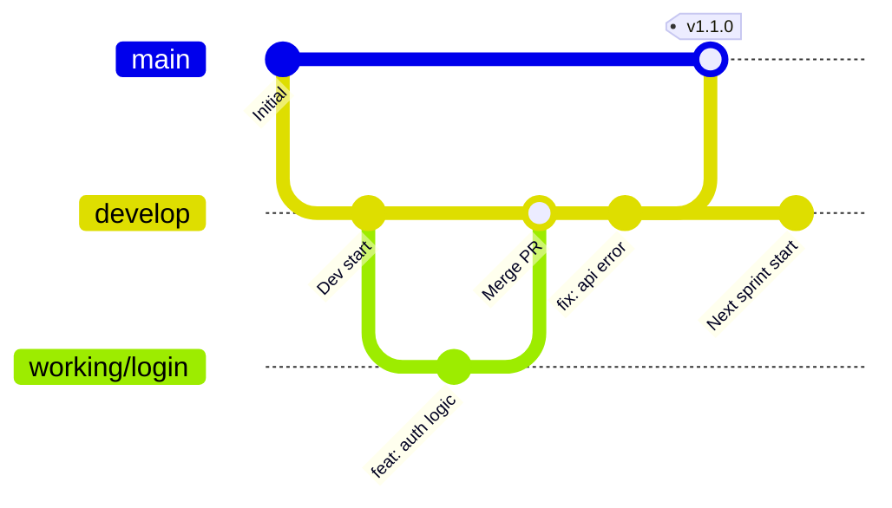

# Version Control Guidelines (Simplified)

이 문서는 프로젝트의 효율적인 협업을 위해 간소화된 버전 관리 전략, 커밋 컨벤션, 워크플로우를 정의합니다.

## 1. Branching Strategy (브랜치 전략)
`main`과 `develop` 두 개의 상시 브랜치를 중심으로 운영하며, 모든 변경 사항은 단기 브랜치를 통해 병합됩니다.

### 상시 브랜치
- **`main`**: 
  - 언제나 배포 가능한 상태(Production Ready)를 유지합니다.
  - `develop` 브랜치에서 충분히 검증된 코드만 병합됩니다.
  - 병합 시 Tag를 통해 버전을 기록합니다 (예: `v1.0.0`).
- **`develop`**: 
  - 실제 개발이 이루어지는 중심 브랜치입니다.
  - 모든 기능 구현과 버그 수정은 이 브랜치를 기준으로 통합됩니다.

### 단기 브랜치 (선택 사항)
- **`feature/*` **: 
  - 특정 작업(기능 추가, 수정)을 위해 `develop`에서 분기하는 임시 브랜치입니다.
  - 작업 완료 후 `develop`으로 PR을 보내고 병합되면 삭제합니다.

## 2. Commit Convention (커밋 컨벤션)
Conventional Commits 규격을 따릅니다. 제목은 명확하게, 본문은 필요할 때만 작성합니다.

### 기본 형식
```text
<type>: <subject>

```

### Type 종류

| Type | 설명 |
| --- | --- |
| `feat` | 새로운 기능 추가 |
| `fix` | 버그 수정 |
| `docs` | 문서 수정 (README, 가이드 등) |
| `style` | 코드 포맷팅, 세미콜론 누락 등 (로직 변경 없음) |
| `refactor` | 코드 리팩토링 |
| `chore` | 설정 변경, 패키지 관리 등 기타 작업 |

### 작성 예시

* `feat: 소셜 로그인 기능 추가`
* `fix: 검색 결과 페이지 로딩 에러 수정`
* `chore: 환경 변수 설정 파일 업데이트`

## 3. Pull Request (PR) & Versioning

* **PR Process**: `develop` 브랜치로 병합하기 전 최소 1명의 검토를 권장합니다.
* **Versioning**: `MAJOR.MINOR.PATCH` 형식을 사용합니다.
* **MAJOR**: 대규모 변경 또는 하위 호환성 깨짐
* **MINOR**: 새로운 기능 추가
* **PATCH**: 버그 수정 및 소규모 개선


## 4. Workflow Diagram

