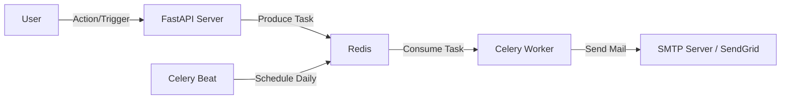

# v0.7.0 설계 명세서 (Design Specs)

본 문서는 Alpha-Sam v0.7.0의 핵심 기능인 **멀티테넌시(Multi-tenancy)** 지원과 **이메일 알림 시스템** 구축을 위한 아키텍처 및 데이터베이스 설계안을 기술합니다.

## 1. 데이터베이스 스키마 설계 (Multi-tenancy)

### 1.1 기본 전략: Hybrid Ownership
시스템은 두 가지 형태의 자산(Asset)을 지원합니다.
1. **System Assets (Global)**: 관리자가 생성하거나 외부 API(Yahoo Finance 등)를 통해 동기화된 공용 자산 (예: `AAPL`, `BTC`). 모든 사용자가 공유하며 `owner_id`는 `NULL`입니다.
2. **Custom Assets (Private)**: 사용자가 개별적으로 생성한 커스텀 자산. 해당 사용자만 볼 수 있으며 `owner_id`가 지정됩니다.

이를 지원하기 위해 `Transaction`과 `Position` 엔티티는 자산의 소유 여부와 무관하게 **반드시 소유자(User) 정보를 명시적으로 포함**해야 합니다.

### 1.2 스키마 변경 (Schema Changes)

#### [MODIFY] `Asset`
- **Current**: `owner_id` (Optional[int]) 존재함.
- **Plan**: 그대로 유지하되, `NULL`일 경우 Global Asset으로 취급하는 로직을 비즈니스 레이어에 강화.

#### [MODIFY] `Position` (Holding)
Global Asset을 보유할 경우, `Asset` 모델을 통해서는 소유자를 식별할 수 없으므로 `Position` 자체에 `owner_id`가 필요합니다.
- **Add Column**: `owner_id` (ForeignKey -> `users.id`)
- **Constraint**: `(owner_id, asset_id)` 복합 유니크 제약 조건 (사용자는 같은 자산에 대해 하나의 포지션 레코드만 가짐).

```python
class Position(SQLModel, table=True):
    # ... existing fields ...
    owner_id: int = Field(foreign_key="users.id", index=True, nullable=False)
```

#### [MODIFY] `Transaction`
마찬가지로 거래 내역의 주체를 식별해야 합니다.
- **Add Column**: `owner_id` (ForeignKey -> `users.id`)

```python
class Transaction(SQLModel, table=True):
    # ... existing fields ...
    owner_id: int = Field(foreign_key="users.id", index=True, nullable=False)
```

### 1.3 마이그레이션 전략 (Migration Strategy)
기존 단일 사용자 기반 데이터들을 마이그레이션하기 위한 전략입니다.

1. **Default User 생성**: 마이그레이션 스크립트 실행 시 `admin` 계정이 없다면 생성.
2. **Data Backfilling**:
   - `owner_id`가 없는 기존 `Position`과 `Transaction`들에 대해 Default User(예: ID 1)의 ID를 할당.
   - `Asset` 중 `owner_id`가 없는 것은 Global Asset으로 간주하거나, 필요 시 Default User 소유로 업데이트. (기본 정책: NULL 유지 -> Global, 또는 Default User 귀속. 현재 v0.6.0 로직에 따라 판단)

---

## 2. 이메일 알림 아키텍처 (Email Notification Architecture)

### 2.1 아키텍처 개요
사용자 경험을 저해하지 않기 위해 이메일 발송은 **비동기(Asynchronous)**로 처리합니다.



### 2.2 기술 스택
- **Task Queue**: Celery
- **Broker**: Redis (기존 인프라 활용)
- **Email Service**: Python `smtplib` (초기) or SendGrid/AWS SES (확장 시)
- **Template Engine**: Jinja2 (HTML 이메일 템플릿)

### 2.3 주요 기능 및 흐름

#### A. 목표가 도달 알림 (Price Alert)
1. **Trigger**: 시장 가격 업데이트 (`POST /prices/refresh` or Background Job).
2. **Process**:
   - 가격 변동 감지.
   - 해당 자산을 보유하거나 관심 등록한 사용자의, 설정된 '목표가' 조건 확인.
   - 조건 충족 시 `send_price_alert_email` 태스크 발행.

#### B. 일일 포트폴리오 리포트 (Daily Report)
1. **Trigger**: 매일 오전 09:00 (KST) - `Celery Beat`.
2. **Process**:
   - `send_daily_report` 태스크 발행.
   - 태스크는 전체 활성 사용자를 순회하며 전날 대비 수익률 계산 후 메일 발송.

### 2.4 DB 추가 모델 (Optional for later)
- `NotificationSetting`: 사용자별 알림 수신 여부 (마케팅, 시스템, 가격 등).
- `PriceAlert`: 자산별 목표가 설정.

---

## 3. 구현 단계 (Implementation Steps)

1. **Phase 1: DB Schema Migration**
   - User 모델 확인 및 Default User 확정.
   - Alembic 마이그레이션 스크립트 작성 (`add_owner_id_to_transaction_position`).
   - 데이터 마이그레이션 실행.

2. **Phase 2: Celery Setup**
   - `backend/app/src/worker.py` (Celery App 설정).
   - Docker Compose에 `redis`, `worker`, `beat` 서비스 구성 확인/추가.

3. **Phase 3: Email Logic Implementation**
   - `EmailService` 클래스 구현 (SMTP 연동).
   - Jinja2 템플릿 작성 (`welcome.html`, `alert.html`).

4. **Phase 4: API & Integration**
   - 가격 업데이트 로직에 알림 트리거 연동.
