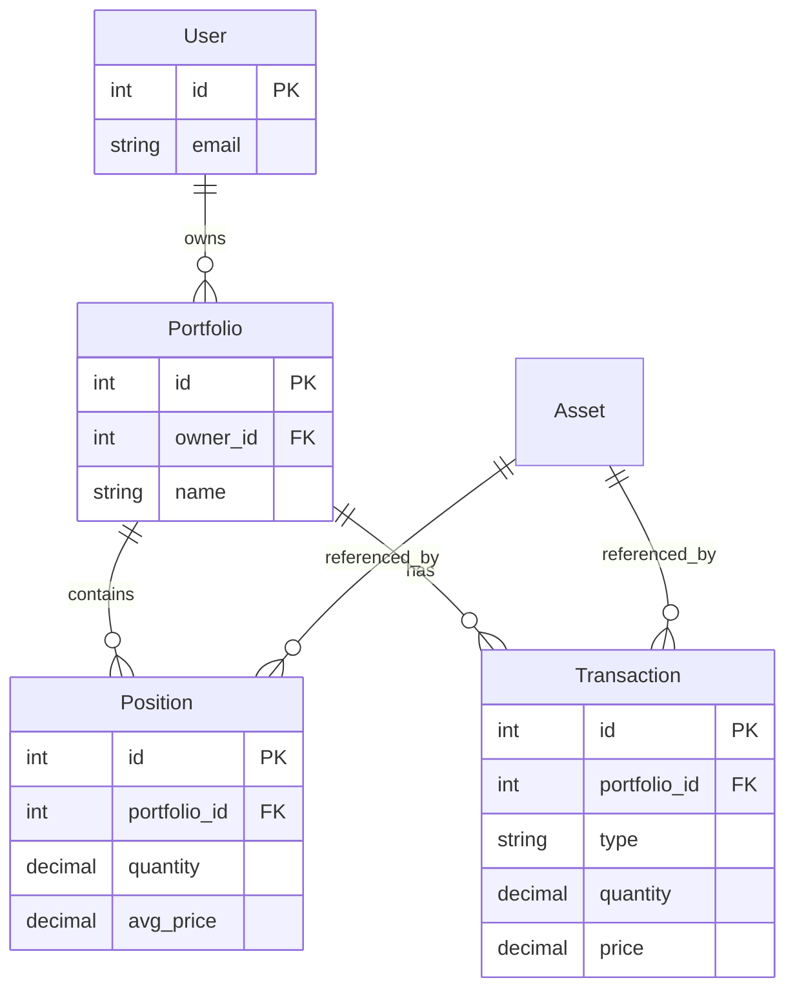

# v1.2.0 Schema Design: Multi-Portfolio & Transaction-based Position

## 1. 개요 (Overview)
기존 `User -- Position`의 단순 구조를 `User -- Portfolio -- Position/Transaction` 구조로 확장합니다.
또한 `Position`을 수기 입력 대상에서 **Transaction 이력에 기반한 계산된 결과(Computed Snapshot)**로 재정의하여 데이터 무결성을 강화합니다.

## 2. Entity Design

### 2.1 Portfolio (New)
사용자는 여러 개의 포트폴리오를 가질 수 있습니다.

| Field | Type | Constraint | Description |
| :--- | :--- | :--- | :--- |
| `id` | Integer | PK | |
| `owner_id` | Integer | FK(User.id), Index | 소유자 |
| `name` | String | Required | 포트폴리오 이름 (예: "Main", "Crypto") |
| `description` | String | Optional | 설명 |
| `currency` | String | Default "USD" | 기준 통화 |
| `created_at` | DateTime | | |

- **Relationship**: User (1) : Portfolio (N)

### 2.2 Transaction (Refined)
자산의 매수/매도 이력을 기록합니다. 포지션 산출의 근거 데이터(Generic Source)가 됩니다.

| Field | Type | Constraint | Description |
| :--- | :--- | :--- | :--- |
| `id` | Integer | PK | |
| `portfolio_id` | Integer | FK(Portfolio.id), Index | **[New]** 귀속된 포트폴리오 |
| `asset_id` | Integer | FK(Asset.id) | 대상 자산 |
| `type` | Enum | "BUY", "SELL" | 거래 유형 |
| `quantity` | Numeric | > 0 | 거래 수량 |
| `price` | Numeric | > 0 | 거래 단가 |
| `executed_at` | DateTime | Required | 실제 체결 시간 |
| `created_at` | DateTime | | |

- **Changes**: 
    - `owner_id` 제거 -> `portfolio_id`로 대체.

### 2.3 Position (Refined as Snapshot)
Transaction 이력을 집계하여 현재 보유 상태를 나타냅니다 (Read-Only 성격).

| Field | Type | Constraint | Description |
| :--- | :--- | :--- | :--- |
| `id` | Integer | PK | |
| `portfolio_id` | Integer | FK(Portfolio.id), Index | **[New]** 귀속된 포트폴리오 |
| `asset_id` | Integer | FK(Asset.id) | 대상 자산 |
| `quantity` | Numeric | >= 0 | 현재 잔고 |
| `avg_price` | Numeric | >= 0 | 평단가 |
| `last_transaction_id`| Integer | FK(Transaction.id) | **[New]** 마지막 반영된 트랜잭션 (Sync 확인용) |

- **Changes**:
    - `owner_id` 제거 -> `portfolio_id`로 대체.
    - Unique Constraint: `(portfolio_id, asset_id)`

## 3. Position Calculation Logic (Spec)
`Position`은 사용자가 직접 수정할 수 없으며, `Transaction`이 추가/수정/삭제될 때마다 재계산됩니다.

1. **매수 (BUY)**:
   - `New Quantity` = `Old Quantity` + `Buy Quantity`
   - `New Avg Price` = ((`Old Qty` * `Old Avg`) + (`Buy Qty` * `Buy Price`)) / `New Quantity`
2. **매도 (SELL)**:
   - `New Quantity` = `Old Quantity` - `Sell Quantity`
   - `New Avg Price` = `Old Avg Price` (매도는 평단가에 영향 없음, 실현 손익만 발생)
   - *단, 전량 매도 시 0 처리.*

## 4. Migration Plan (v0.9 -> v1.2)
기존 데이터를 보존하면서 새로운 구조로 이관합니다.

1. **Schema Update**: `Portfolio` 테이블 생성, `Position/Transaction`에 `portfolio_id` 컬럼 추가 (Nullable).
2. **Data Migration (Script)**:
   - 모든 `User`에 대해 "Default Portfolio" 레코드 자동 생성.
   - 기존 `Position` 및 `Transaction`의 `owner_id`를 기반으로, 해당 유저의 "Default Portfolio" ID를 `portfolio_id`에 할당.
3. **Constraint Enforcement**:
   - `portfolio_id`를 `NOT NULL`로 변경.
   - 기존 `owner_id` 컬럼 제거 (또는 Deprecated 처리).
   - `Position` 테이블의 수기 입력 데이터 검증 (Transaction과 불일치 시 보정 로직 필요 -> 초기엔 그대로 유지하되, 추후 TransactionReplay로 덮어쓰기).

## 5. ERD (Mermaid)

